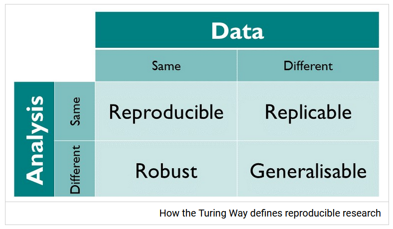

```{r setup, include=FALSE}
knitr::opts_chunk$set(echo = TRUE)
```

In this workshop we'll go through some basics on how to create, structure, and document reproducible projects in R.
By the end of this workshop you will have created an online version of that project that everyone can interact with **without having to download anything**. In the process you'll also get some practice with git and GitHub.

Prerequisites:

* [R](https://www.r-project.org/) and [RStudio](https://rstudio.com/products/rstudio/download/) are installed
* git is installed (see [here](https://happygitwithr.com/install-git.html) for a guide on how to install git on different operating systems)
* git and RStudio have been connected (see [here](https://support.rstudio.com/hc/en-us/articles/200532077-Version-Control-with-Git-and-SVN) for a guide on how to do that)
* you have created a [GitHub](https://github.com) account
* you have created an R project with version control from [here](https://github.com/eirini-zormpa/IMPRSConf2020).

Your level of R proficiency really doesn't matter for this, most interaction with code will be basically incidental.
That being said, you will have a chance to explore some data and practice whatever R skills you feel like practicing (data wrangling, plotting, or analysis) if you feel like it.

You also don't need to be super comfortable with Git.
We will not be doing anything particularly advanced here and I will always include the commands you will need.
In fact, everything we are doing should be possible through the RStudio IDE for git.

# Getting started
## Definitions
Before we get started, it's probably useful to agree on some definitions.
Thrilling stuff, I know, but bear with me.
*Reproducibility* has been taken to mean a variety of things, but here by reproducibility I mean *the ability to use someone else's data and code to get the same results they did*.
You could also call that *computational reproducibility*.
I quite like the chart from the [Turing Way](https://the-turing-way.netlify.app/reproducibility/03/definitions), reproduced below [@turing_way2019]:



An assumption implicit in all this is that **your code and data are available online**.
We won't cover where to share data and code in this workshop, but feel free to ask if you have any questions about that!

## Why does reproducibility matter?
You're in this workshop already, so I'm guessing you have your own answers to this, but here's my two cents:

* reproducibility is a minimum requirement for verifying research.
* reproducibility can make you more organised and save you time if you ever need to go back to some of your analyses.

Head over to Mentimeter and describe with one word why reproducibility matter to **you**!
Use the code 809822.

Now let's get started on **how to make your analyses more reproducible**.

# Project set-up
Most of what we'll cover today does not actually involve much code--we'll mostly work on setting up projects with reproducibility in mind.

## Documentation
Good documentation is vital for helping others not only reproduce, but also understand your code.
As I mentioned before, your code and data needs to be available, but if it's completely incomprehensible that's still not very useful!

As you may have noticed, this project has almost no documentation.
That's because we'll be making it together!

### License
I cannot stress how important it is that you **license everything you share**.
Licenses are important because they tell others how they can use your work.

**If you don't attach a license to your code/data/materials/whatever you're severely limiting how people can use it.**.

You hold the copyright of whatever it is you have created.
As you^[In fact, it is often your university or institute that holds the copyright to the work you created while working there] are the copyright holder, anyone who wants to use your work should technically ask for your permission to be able to do so.
For example, if someone wants to use your data in a meta-analysis or if they want to reuse an awesome function you wrote to analyse their data, they would need to ask you first.
Attaching a license to your work is like giving instructions to others about what they can do with it without having to ask you every time.

Technically, you could just come up with your own licenses for whatever you share.
But...


The [Open Source Initiative (OSI)](https://opensource.org/licenses) has reviewed and approved enough open source licenses to cover whatever it is you want people to be able to do with your work.
You can find a nice guide on the most popular licenses [here](https://arstechnica.com/gadgets/2020/02/how-to-choose-an-open-source-license/).

You may have heard of the Creative Commons (CC) licenses.
These are great for a lot of creative work, e.g. articles or presentations, but they should generally be avoided for software.
If you like the CC-BY license, a software license that gives similar permissions is the MIT license.

#### Practice
So how do we add a license to our project?
You can do this really easily from GitHub:

1. Click on `Create new file`
2. Name your new file "LICENSE"
3. Click on `Choose a license template`
4. Select the MIT license (you can also preview your changes at this point)
5. Add an informative commit message
6. Click on `Commit directly to the master branck`

Wow, we've actually made a change to this project!!
This means that you now have a file on your GitHub project that doesn't exist on the project version stored locally on your computer.
To get the file from GitHub to your local machine, you need to **pull** from GitHub.
Go to your RStudio and click on your Git tab (on the pane where your Environment is, by default on the top right).
There you will see a light blue arrow facingdownward.
Click on it!

You should now see the LICENSE file if you look at your folder!

### README
Now people know how they can use your work, but they don't know what your work is, how to use it, and whether they' would want to use it'd want to!
This brings us to another crucial piece of documentation you should include in every single project--the **README file**.
The contents of your README will depend on the project you're sharing, but it should generally cover:

* what your project is about
* installation instructions
* prerequisites (e.g. required software)
* license information
* other contributors

The above are sections you'd expect to see in any project shared on GitHub.
When sharings scientific code that's associated with a publication, you should also share a 'reproducibility recipe'.
By that I mean telling people in what order they should run your scripts, in which script you run the analyses that are reported in your manuscript etc.
If reproducing your analysis takes a while (e.g. because one/some of the models takes a few hours to converge) that would also be useful information to include.

#### Practice
You'll notice that GitHub really tries to get people to add README files.
It's already asking you to `Add a README`, so let's not disappoint GitHub!
To create a README file:

1. Click on the `Add a README` button
2. Edit the file to include relevant information (you don't need to spend too much time on this right now)
3. Write an informative commit message
4. Commit your changes

Again, make sure to go back to your RStudio and **pull your changes** from GitHub to your local repository.

### Codebook
The last important piece of documentation we'll discuss today is the **codebook**.
A codebook is a file in which you describe your **data**.
Codebooks are immensely useful when trying to reuse someone else's data, but they can also be really useful for reproducibility purposes.
The reason is that it's easier to reproduce an analysis when you understand what it's trying to do.
When you don't understand what the data are or what the code means, it can feel impossible to troubleshoot errors if something goes wrong.

Codebooks should include information on:

* how many observations are contained in the dataset
* the different variables (e.g. what they measure, in what units they measure it, how they are distributed)
  * especially for categorical variables that may often by coded as 0s and 1s, there should be an explanation of what the codes refer to.
* whether there are missing data and how they are coded
* whatever else is considered standard/important in your discipline

The `codebook` package can be used to automate the creation of machine-readable codebooks [@arslan2019].
I made the codebook for this dataset by following the instructions (here)[https://github.com/rubenarslan/codebook].

## Folder structure
Another way to make it easy for people to understand your project is to use a good folder structure.
Honestly, even if you don't care about reproducibility, good folder structure helps with organisation and there's no downsides to that!
So, what do I mean by *good folder structure*?

1. Each project should have its own separate directory.
2. Everything that is needed to reproduce that project should be contained within **the same folder**.
    * this way, when you're done you just share **that one folder** and feel confident you haven't forgotten anything
3. Within that folder, files should be organised in clearly named subfolders (e.g. data, code, manuscript)

**IMPORTANT**
Always separate your **raw data** from your **processed data**.
Ideally, you will never make any changes to your raw data manually: it's best to do all your processing with a script and save a copy of the processed files in a different folder

You can also check out some standardised formats, e.g, the [DRESS protocol](https://www.projecttier.org/tier-protocol/dress-protocol/).

### R Projects
R projects are absolutely wonderful for reproducibility.
They:

* Are self-contained.
  * Everything that someone may need to reproduce your analysis **lives in the same project folder**.
* Start in a new session, giving you a clean environment without any loaded data, functions, or packages.
  * This way you know that anything that happens when running your script is because of what exists in your script.
  * i.e., no more `rm(list = ls())`
* Set the working directory to the project root
  * This way you can use relative paths starting from the project root that will work on **anyone's** computer, not just yours!
  * i.e., no more `setwd("C:\Users\path\only\you\have")`

And if that's not enough, they can save your computer from [Jenny Bryan's wrath](https://www.tidyverse.org/blog/2017/12/workflow-vs-script/).


You know, if you're seeing this file, you're already using an R project!
That's **awesome**.
For this project, we created an R project from version control.
You can also create a new project in a new folder or in an existing folder.
You can create R Projects easily from `File` -> `New project`, or from the other shortcuts on the toolbar.

You'll know that you're using R projects, because they create an icon in your folder with the extension `.Rproj`.
When you want to go back to working on that project, don't open the individual scripts you want to work on, but click on the `.Rproj` file instead.
That will open a fresh R session for you.

Now that we have a portable, well-documented project to work with, let's finally look at some code!

# Example code
For this workshop, we'll be using data from the World Happiness Reports (years 2015-2019), a survey used to rank the happiness of people in the participating countries.
I downloaded these data from [kaggle](https://www.kaggle.com/)--you can find the entry for this particular dataset [here](https://www.kaggle.com/unsdsn/world-happiness).

Base R comes with a lot of functions for wrangling and analysing data, but you can add even more functionality through packages.
In this workshop, I'll be using packages from the [`tidyverse`](https://www.tidyverse.org/), an "opinionated collection of R packages [...] with an underlying philosophy, grammar, and data structures".

Generally speaking, it's nice to load your packages at the beginning of the script.
That way whoever is looking at your script knows what packages they will need.
I like listing the install command at the beginning as well (commented out), so people can install packages if they want to.

```{r load_packages, collapse=TRUE}
# install.packages("readr")
# install.packages("janitor")
# install.packages("tidyr")
# install.packages("dplyr")
# install.packages("ggplot2")

# to read in data as tibbles
library(readr)
# for easy data (in this case name) cleaning
library(janitor)
# for tidying data
library(tidyr)
# for wrangling data
library(dplyr)
# for beautiful plots
library(ggplot2)
```

Loading the packages gives me some warnings.
These are okay to ignore, R is just telling me that I have loaded packages that share function names.
Whichever was loaded last will be the one called, but I can still access the masked function by specifying which package I want.
This won't really be an issue today, but something to keep in mind.

## Session info
It's really important to tell people what **software versions** you used for your analysis.
The reason it's important is that software updates can very easily break your code (e.g. the recent R 4.0.0 version release).
That is, if someone (including yourself) tries to run your code in 5 years, it's quite likely that some parts of it won't work.

If people know what versions last worked (and if they really care), they can always go back and try to reproduce the analysis with those versions.
That's *a lot* of work for the reproducer, but it's very easy to share, so why not!
An easy way to report these versions is by printing the session info at the beginning or the end of your analysis.
By the end of the workshop you'll (hopefully) know of better ways to help others reproduce your code.

```{r session_info}
sessionInfo()
```

## Relative paths
Before we do anything, we need to get some data into R.
Every time you want to read in data, import functions from a script, or export any files, you'll need to point to unique locations in your folders.

As I mentioned before, it's important to use **relative paths** as opposed to **absolute paths** when you do that.
An absolute path starts from the root directory and lists the full path from your root directory to the location you're trying to point to.
The problem with that is that the chances two people share an absolute path to any file are vanishingly small.
So, every time you include an absolute path in your scripts, you are writing code guaranteed to not work on someone else's computer.
Since the goal of reproducibility is to write code that runs on other people's computers, this is an issue!

To make this point, type `getwd()` in your console and look at the path you got.
I got:

`[1] "C:/Users/eirin/Documents/MPI Psycholinguistics/Teaching/IMPRSConf2020"`

How far along my path does yours diverge?
Head to Mentimeter (code ) and tell us how far you got!

Changing that code to the correct path is not that difficult, but it's also very easy to write relative paths instead, so that's what we're going to do.
A relative path does not start from the root, but rather from a given working directory.
Because we're using R projects, that given working directory is the folder in which the .Rproj file is located.

Now we know this, let's read in some data!
You can see below my feeble attempt to read in the data from 2019.
I mean... it works, but my computer is in danger!

```{r read_data_bad, message=FALSE}
setwd("C:/Users/eirin/Documents/MPI Psycholinguistics/Teaching/IMPRSConf2020")
ds <- read_csv("raw-data/2019.csv")
```

#### Practice
We can do better than this!
```{r read_data_exercise1}
# read in the data using a relative path
# if you ran the code above feel free to use 'ds' when reimporting the data

```
**Hint**: you don't need to set the working directory anymore, R projects do that for you.

An even better way to use relative paths is the `here` package.
`here` will look for certain files (e.g. an .Rproj or a .here file) to use as the root directory.
This is useful for R Markdown files, because they use as the working directory the folder in which they are located.
You can test this by running `getwd()` inside a code chunk and then in your console.

As always in R, you can install the `here` package by running `install.packages("here")` and load it by running `library(here)`.
To learn more about this you can type `?here::here()` in your console.
```{r read_data_exercise2}

```

## Data tidying and plotting
Now that we got our data into R, let's see what it looks like!
```{r glimpse_data}
# glimpse is a function from the dplyr package that gives you a, well, glimpse of your tibbles.
glimpse(ds)
```

Before we go any further, we need to deal with these names.
Spaces are generally not allowed in column names^[Avoiding spaces is generally a good idea when naming folders or files too.] in R (here R is using the backticks to allow the spaces).
A really handy way to get clean names when using  this is by using the `janitor` package.
```{r clean_names}
ds = janitor::clean_names(ds)
```

Let's take a look at what this has done:
```{r check_names}
glimpse(ds)
```

Okay, that looks much better!

Let's explore our data a little bit.
I'm from Greece and was curious to see how Greece ranks in this survey.
```{r greece_happiness}
# In R, '%>%' is the pipe symbol, which takes the output of a previous function and passes it on as the input to the next function 
ds %>% filter(country_or_region == "Greece")
```

Feel free to explore these data a little bit too!
```{r }
# pick a country (whichever country) and see where it ranks
# head on over to Mentimeter (code 951314) and tell us which country you picked!

```

We can also play around with plots a little bit.
Here I've made a lollipop plot of the 10 happiest countries, ordered by their overall score.
```{r rank_lollipop}
ds %>%
  filter(overall_rank <= 10) %>%
  arrange(desc(overall_rank)) %>%
  mutate(country_or_region = factor(country_or_region, levels = country_or_region)) %>%
  ggplot(aes(x=country_or_region, y=score)) +
  geom_point(size = 4, colour = "skyblue") + 
  geom_segment( aes(x=country_or_region, xend=country_or_region, y=6.5, yend=score)) +
  coord_flip() +
  theme_bw() +
  labs(x = "Overall happiness score", y = "")
```

Well according to this, I should be happy to have moved to the Netherlands!

Feel free to practice your ggplot2 skills here if you like.you can plot whatever you find interesting.
```{r your_plot}
# you can plot whatever you find interesting
# the data for previous years are also available so, for example, you could explore how the ranking of countries may have changed

```

# Binder
Reproducibility can be seen as a spectrum: some analyses are more reproducible than others [@peng2011].
You can see such a spectrum below:


The project we have created until now is pretty reproducible: the code and data are freely available online and they're pretty well documented.
But there's still a lot of room for improvement!

As I mentioned in the 'Session Info' section, software versions can easily break your code.
Sharing the versions of the software you used is helpful, but installing older versions of packages is a lot of work.
Wouldn't it be even better if you could share a version of your project that comes with all the right software versions?
Wouldn't it be ever betterer if this was online and people didn't need to download **anything**?
What I'm describing here is called a **Binder**: "A sharable version of a project that can be viewed and interacted within a reproducible computational environment via a web browser" [@turing_way2019].

You can actually see a Binder for this very project by clicking [here](UPDATE)

Binders seem super fancy, but thankfully creating them is super easy!
We already have everything needed to create one.

Ingredients:

* A public GitHub (or other) repository
* An `install.R` file
  * this includes `install.packages()` commands for all the packages you use in a script(+ `knitr` because this is an R Markdown document)
* A `runtime.txt` file,  containing the day you last ran this code.
  * in this case `r-2020-05-24`.
  
Literally. That is all you need!

To create the Binder:
* Go to the [Binder](https://mybinder.org/) website
* In `GitHub repository name or URL`, paste the link to your GitHub repository
* You don't need to fill anything in the `Git branch, tag, or commit` field
* In the `Path to a notebook file (optional)` field, you'll see a dropdown menu that currently says `File`. Change it to `URL`.
* In the (now called) `URL to open` field, type 'rstudio'.
  * this tells binder to launch an RStudio window instead of a jupyter notebook (the default).
* Click on launch
* Waaaaiiiiiit

Binder is awesome, but it can be pretty slow.
You can speed it up by using fewer packages and not including the data (by reading it from an online source for example).

You can also launch binders from **within R** using the [`holepunch`](https://github.com/karthik/holepunch) package, created by Karthik Ram.

# Thank you!
Thank you so much for following along with this workshop, I hope it was useful!
If you want to learn more about how to make your work more reproducible, I strongly encourage you to take a look at the *Turing Way book*, a 'lightly opinionated guide to reproducible data science'.
It is super easy to follow guidelines and you'd be hard-pressed to find a more welcoming community.

In terms of R packages for all your reproducibility needs, do checl out Ben Marwick's [`rrtools`](https://github.com/benmarwick/rrtools) package.
The `rrtools` package can be used for making a *research compendium* based on the structure of R packages.
Karthik Ram gave an awesome (and beautifully illustrated) presentation on this at rstudio::conf(2019), the materials for which you can find [here](https://github.com/karthik/rstudio2019).

# References
